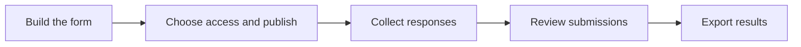

# NC3 Submission Platform

**Online forms for structured submissions and collaborative review.**

The NC3 Submission Platform is built by the **National Cybersecurity Competence Center (NC3)**, part of the **Luxembourg House of Cybersecurity**. It helps teams create forms, collect responses and supporting documents, and give the right people access to review them.

Use it for reporting, applications, questionnaires, or other processes that need a consistent set of questions and controlled access to the answers. Form owners manage the questions and sharing; respondents complete the form; assigned evaluators review the submissions and export results.

[Read the wiki](https://github.com/NC3-LU/submission-platform/wiki) · [Local quick start](#local-quick-start) · [API reference](docs/api.md) · [Report an issue](https://github.com/NC3-LU/submission-platform/issues)

## What you can do

| Capability | What it provides |
| --- | --- |
| Build forms without code | Ordered sections, short and long text answers, single and multiple choices, file uploads, and explanatory headings |
| Tailor the experience | Conditional questions, required fields, character limits, Markdown descriptions, and optional header images with adjustable position and accent colour |
| Control access | Public forms, forms that require sign-in, private forms, expiring and revocable access links, and assigned collaborators |
| Manage the response lifecycle | Opening and closing dates, drafts and autosave for signed-in respondents, form duplication, archiving, and ownership transfer |
| Review responses | Submission lists, search and status filters, private attachment downloads, and scan details when malware scanning is enabled |
| Export results | PDF and JSON for individual submitted responses; JSON and XLSX for form-wide exports; background exports through the API |
| Connect other systems | API v1 for forms, responses, access links, collaborators, token management, exports, and optional signed webhooks |

## How it works



Creating forms requires an administrator or evaluator account. Respondents can use public forms as guests, sign in for authenticated forms and saved drafts, or follow a valid private access link.

Publishing a form makes its questions available to the intended audience; answers remain permission-controlled. Submitted answers are fixed. Once any response exists, including a saved draft, duplicate the form to revise its questions while preserving existing answers. Optional attachment scanning runs in the background and can hold downloads until a clean result is available.

## Find the right guide

The [GitHub wiki](https://github.com/NC3-LU/submission-platform/wiki) is the main guide for everyday use and project onboarding. Its [Markdown sources](docs/README.md) are also available in this checkout.

| I want to… | Start here |
| --- | --- |
| Fill in a form or resume a draft | [Submitting a response](https://github.com/NC3-LU/submission-platform/wiki/Submitting-a-Response) |
| Create, publish, or share forms | [Managing forms](https://github.com/NC3-LU/submission-platform/wiki/Managing-Forms) |
| Read responses and export results | [Reviewing submissions](https://github.com/NC3-LU/submission-platform/wiki/Reviewing-Submissions) |
| Install a development copy | [Getting started](https://github.com/NC3-LU/submission-platform/wiki/Getting-Started) |
| Deploy and maintain the service | [Running the platform](https://github.com/NC3-LU/submission-platform/wiki/Running-the-Platform) |
| Connect an integration | [API and integrations](https://github.com/NC3-LU/submission-platform/wiki/API-and-Integrations) |
| Understand the code | [Development](https://github.com/NC3-LU/submission-platform/wiki/Development) |
| Resolve a common problem | [Troubleshooting](https://github.com/NC3-LU/submission-platform/wiki/Troubleshooting) |

## Technology and requirements

| Component | Technology |
| --- | --- |
| Backend | PHP 8.3+, Laravel 13 |
| Browser interface | Blade, Livewire 3, Tailwind CSS 3.4 |
| Administration and accounts | Filament 3, Jetstream, Fortify, Sanctum |
| Database | MySQL 8.0; SQLite is used for the default test suite |
| Frontend build | Vite 8; Node.js 24 is used by CI and Docker builds |
| Exports and API documentation | DomPDF, OpenSpout, Scramble |
| Optional malware scanning | [Pandora](https://github.com/pandora-analysis/pandora), with a ClamAV worker in the supplied stack |

A local installation also needs Git, Composer 2, npm, and the PHP extensions required by Composer. These include cURL, DOM/XML, fileinfo, GD, intl, mbstring, PDO MySQL, and ZIP; add PDO SQLite for local tests. The [PHP manifest](composer.json) and [frontend manifest](package.json), together with their lockfiles, define the exact requirements.

## Local quick start

These steps are for a **new local development installation** with MySQL already running. Use the [operations runbook](docs/operations.md) for an existing or production installation.

### 1. Get the code and dependencies

```bash
git clone https://github.com/NC3-LU/submission-platform.git
cd submission-platform
composer install
npm ci
cp .env.example .env
```

### 2. Configure the database and application

Create an empty MySQL database and an account with permission to manage its tables. Set the corresponding values in `.env`, for example:

```dotenv
APP_NAME="NC3 Submission Platform"
APP_URL=http://127.0.0.1:8000

DB_CONNECTION=mysql
DB_HOST=127.0.0.1
DB_PORT=3306
DB_DATABASE=submission_platform
DB_USERNAME=submission_app
DB_PASSWORD=REPLACE_WITH_YOUR_LOCAL_DATABASE_PASSWORD
```

Use your actual local database credentials. The example environment uses database-backed sessions, cache, and queues, logs mail locally, and leaves Pandora and webhooks disabled. Keep `.env` out of version control.

### 3. Initialize the installation and create an account

```bash
php artisan key:generate
php artisan migrate
php artisan storage:link
npm run build
composer check-platform-reqs
php artisan user:create --role=internal_evaluator
```

The account command prompts for a name, email address, and password. An internal evaluator can create and manage forms. To create an administrator instead, use `php artisan user:create --role=admin`.

Generate `APP_KEY` once for a new installation and preserve it during upgrades. The storage link serves public assets such as form banners; submission attachments stay on the private disk.

### 4. Start the web application and background services

Run each command in a **separate terminal**, from the project directory:

```bash
# Terminal 1: web application
php artisan serve --host=127.0.0.1 --port=8000
```

```bash
# Terminal 2: background jobs, including exports and enabled scans/webhooks
php artisan queue:work --tries=3 --sleep=3 --timeout=180
```

```bash
# Terminal 3: scheduled cleanup, recovery, and health heartbeats
php artisan schedule:work
```

Open [http://127.0.0.1:8000](http://127.0.0.1:8000), sign in, and complete email verification. With the default `MAIL_MAILER=log`, the verification message is written to `storage/logs/laravel.log` instead of being emailed.

The `/admin` panel currently requires the `admin` role **and a verified `@nc3.lu` email address**. Evaluators use **My Forms** without entering the admin panel. This deployment-specific restriction is tracked in [#72](https://github.com/NC3-LU/submission-platform/issues/72).

### 5. Try a complete submission

Run `php artisan app:health`, then create a disposable form in **My Forms**. Add a section and a question, preview the form, and publish it. Submit a sample response and open **Submissions** to read it or try an export.

For help with local email, missing assets, or access settings, follow the [setup guide](https://github.com/NC3-LU/submission-platform/wiki/Getting-Started).

## Deployment and operations

The repository includes two Docker layouts:

| Layout | How requests reach the application |
| --- | --- |
| [docker-compose.yml](docker-compose.yml) | Apache inside the application container, with routing over the external `dokploy-network` |
| [docker-compose.prod.yml](docker-compose.prod.yml) | Host Apache serves `public/` and forwards PHP requests to PHP-FPM on `127.0.0.1:9000` |

Both layouts include the database, queue worker, and scheduler. The default Compose file expects its external network and reverse-proxy routing; it does **not** publish a localhost application port. See the [deployment guide](https://github.com/NC3-LU/submission-platform/wiki/Running-the-Platform) before starting a layout.

The [operations runbook](docs/operations.md) covers production configuration, health checks, encrypted backups, deployment, rollback, and isolated restore drills. `scripts/deploy.sh` requires a backup location, protected backup passphrase file, and health URL. Preserve the existing application key and persistent volumes when upgrading.

### Optional attachment scanning

Pandora must be running and reachable from the application and its worker. Configure the application with:

```dotenv
PANDORA_ENABLED=true
PANDORA_URL=http://pandora:6100
PANDORA_TIMEOUT=30
PANDORA_POLL_INTERVAL=2
PANDORA_BLOCK_MALICIOUS=true
```

The example hostname is for the supplied Docker network. Enabling these settings does not start the scanner infrastructure; see the Compose `pandora` profile and [setup script](scripts/setup-pandora.sh), which requires `true` as its first argument.

With scanning and blocking enabled, downloads require an explicit clean verdict. Pending, missing, failed, or malicious scan results remain blocked. Authorized viewers can inspect stored scan details. Private storage controls download access; encryption of submission files at rest remains a roadmap item.

## API and integrations

The API base path is **`/api/v1`**. Application API tokens support scoped abilities, optional IP restrictions, expiry, rotation, and revocation. Tokens are stored as hashes, and plaintext credentials are shown only when issued or rotated. Each request must also satisfy the account's permissions.

Interactive documentation is available at **`/docs/api`** on a running installation, subject to its documentation access policy. `API_DOCS_ALLOWED_DOMAINS` controls allowed email domains unless saved API settings override it. Use the [API contract](docs/api.md) for exact payloads, limits, permissions, and migration notes.

For a first authenticated request, provide `SUBMISSION_API_TOKEN` through your local secret-management process and replace the example hostname:

```bash
curl --fail-with-body \
  --header 'Accept: application/json' \
  --header "Authorization: Bearer ${SUBMISSION_API_TOKEN}" \
  'https://submission.example.org/api/v1/me'
```

Background JSON/XLSX exports require the queue worker and expire 24 hours after request. Webhooks are opt-in through `WEBHOOKS_ENABLED=true`; receivers must verify signatures and handle duplicate deliveries. The [integration guide](https://github.com/NC3-LU/submission-platform/wiki/API-and-Integrations) explains both flows.

## Development and contributing

For frontend changes, run `npm run dev` in an additional terminal. Common verification commands are:

```bash
composer lint            # Check PHP formatting
composer test            # Run the PHPUnit suite
npm run build            # Build production frontend assets
```

`composer lint:fix` applies PHP formatting. `composer test:coverage` produces an HTML coverage report when a coverage driver is installed. Browser tests use Playwright:

```bash
npx playwright install --with-deps chromium
npm run test:browser
```

The default PHPUnit suite uses an in-memory SQLite database with Pandora disabled. CI also tests against MySQL, checks API concurrency, runs browser and accessibility checks, and builds both container targets. See [Development](https://github.com/NC3-LU/submission-platform/wiki/Development) for the code map and test setup.

To contribute, check [existing issues](https://github.com/NC3-LU/submission-platform/issues), describe the behavior you want to change, and open a focused pull request with the relevant verification results. Update the wiki sources or reference documentation when behavior changes. Report suspected vulnerabilities privately using the contacts below.

## Current limitations and planned work

The [issue tracker](https://github.com/NC3-LU/submission-platform/issues) records fixes and planned features. In particular:

- Browser and API bulk exports currently use different evaluator permission rules ([#69](https://github.com/NC3-LU/submission-platform/issues/69)).
- The completed-response filter needs a URL workaround until [#70](https://github.com/NC3-LU/submission-platform/issues/70) is resolved; see [Troubleshooting](https://github.com/NC3-LU/submission-platform/wiki/Troubleshooting#the-completed-response-filter-is-empty).
- A dedicated browser review screen ([#73](https://github.com/NC3-LU/submission-platform/issues/73)) and custom workflow builder ([#74](https://github.com/NC3-LU/submission-platform/issues/74)) are planned. Review statuses already exist; configurable approval sequences are unfinished.
- Email-code invitations, encrypted submission-file storage, and expanded scanner integrations remain roadmap items.

Read the [changelog](CHANGELOG.md) for released changes. A deployed instance may run an earlier release or have optional integrations disabled.

## Support, security, and license

For questions about a particular form, contact the team that shared it. For project enquiries, contact **info@lhc.lu**.

Report security issues privately through [GitHub Security Advisories](https://github.com/NC3-LU/submission-platform/security/advisories) or **abuse@lhc.lu**. Direct data-protection enquiries to **privacy@lhc.lu**. Remove credentials, private access links, and personal answers from public issue reports.

The NC3 Submission Platform is developed by the **National Cybersecurity Competence Center (NC3)**, part of the **Luxembourg House of Cybersecurity**, and is licensed under the **GNU Affero General Public License v3.0**. See [LICENSE](LICENSE) for the full license text.
