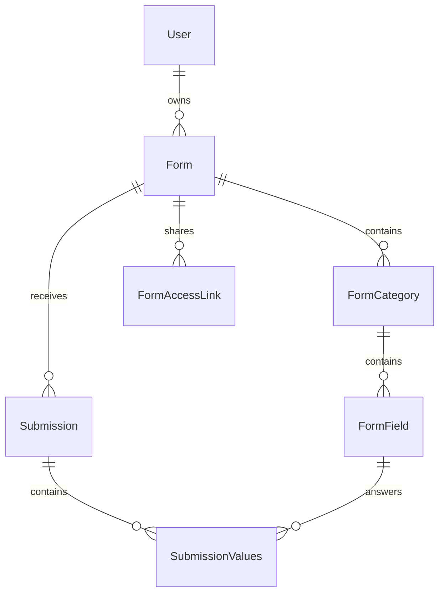

# Development

The platform is a Laravel application. Most browser pages are rendered on the server, with Livewire handling interactions such as editing questions and saving drafts. The API has its own controllers and shares application services with the browser where the same rules apply.

Start with [Getting started](https://github.com/NC3-LU/submission-platform/wiki/Getting-Started) for a local installation.

## Technology map

| Part | Technology in the current project |
| --- | --- |
| Backend | PHP 8.3+, Laravel 13 |
| Interactive browser components | Livewire 3 |
| Administration | Filament 3 |
| Account features | Jetstream, Fortify, and Sanctum; application API v1 tokens have a separate store |
| Templates and styles | Blade, Tailwind CSS 3.4 |
| Frontend build | Vite 8, with Node 24 in CI and containers |
| Database | MySQL 8.0; SQLite is also used for tests |
| PDF and spreadsheet output | DomPDF and OpenSpout |
| API documentation | Scramble |
| Optional malware scanning | Pandora |

`composer.json`, `package.json`, and their lockfiles define the dependencies. Historical plans and older assistant notes may describe a previous framework version.

## Find the code you need

Paths are relative to the [repository root](https://github.com/NC3-LU/submission-platform).

| Path | Responsibility |
| --- | --- |
| `routes/web.php` | Browser pages and actions |
| `routes/api.php` | API routes, token abilities, and throttling |
| `routes/console.php` | Scheduled maintenance and recovery |
| `app/Livewire/` | Form building, answering, and submission lists |
| `app/Http/Controllers/` | Browser request handling and exports |
| `app/Http/Controllers/Api/` | API request handling |
| `app/Http/Requests/` and `app/Http/Resources/` | Input validation and API response shapes |
| `app/Policies/` and `app/Http/Middleware/` | Account, form, submission, and request access rules |
| `app/Services/` | Answer validation, files, duplication, tokens, exports, webhooks, and health checks |
| `app/Jobs/` | Background scanning, export generation, and webhook delivery |
| `app/Models/` and `database/migrations/` | Stored records, relationships, and schema changes |
| `app/Filament/` | Administrative screens |
| `resources/views/` and `resources/css/` | Browser templates and styling |
| `tests/` | Unit, feature, API, concurrency, and browser checks |
| `docker/` and `scripts/` | Container configuration and operational procedures |

## Follow a response through the system

1. A form contains ordered categories and fields. Its owner, publication status, visibility, and availability window determine how it can be used.
2. `SubmissionForm` handles browser interaction; API requests enter through the API controllers.
3. `SubmissionAnswers` centralizes rules for required answers, choices, and conditional questions.
4. A `Submission` stores the response identity and status. `SubmissionValues` stores its individual field answers.
5. Attachments use private storage. Background scan jobs record results, and `SubmissionFiles` provides the API's file metadata and download handling.
6. Reviewers use authorized views and exports. Enabled webhooks notify integrations of supported model events.



Form assignments add collaborators independently of ownership. API tokens, export records, webhook endpoints, and audit records support integrations around this core model.

## Rules to preserve when making changes

- Check authorization on the server, including the relationship between a form and any child record in its URL.
- Keep draft answers private and submitted answers fixed. Question-structure changes must preserve existing responses; duplication is the supported route once responses exist.
- Keep attachments private and preserve scan-dependent download behavior.
- Keep API abilities and account permissions as separate checks. Application API v1 tokens are not interchangeable with legacy Sanctum tokens.
- Preserve existing database records, storage volumes, and encryption keys during upgrades.

The current browser bulk-export policy allows appointed evaluators without requiring edit permission; asynchronous API exports require edit permission. Treat this difference explicitly when working on exports. The browser's completed-response list also needs the `showCompleted=1` query parameter because it has no separate toggle yet.

## Useful development commands

```bash
npm run dev
composer lint
composer test
npm run build
```

Run these as appropriate to the change; `npm run dev` stays running. The default PHPUnit configuration uses an in-memory SQLite database and disables Pandora. CI also runs the PHP suite against MySQL, checks concurrent API mutations, builds frontend assets and both container targets, and runs browser and accessibility checks.

For browser checks after installing dependencies and building assets:

```bash
npx playwright install --with-deps chromium
npm run test:browser
```

The Playwright configuration starts its own application on port 8767 with a temporary database and storage. Use disposable data for tests. Never point test runs at a production database.

To generate OpenAPI documentation, use a migrated disposable database:

```bash
php artisan scramble:export --path=/tmp/submission-openapi.json
```

Schema introspection requires the tables to exist. Compare any API behavior changes with the [API contract](https://github.com/NC3-LU/submission-platform/blob/main/docs/api.md).

## Keep the documentation current

The human guide is maintained as Markdown under `docs/wiki/` and published to this GitHub wiki. Update the relevant page when a user journey, permission, setup command, or operating requirement changes. Keep exact API and production procedures in their existing reference documents.

In a checkout containing these documentation sources, follow `docs/wiki-publishing.md` to review and publish changes. The repository and wiki have separate Git histories, so publishing one does not automatically update the other.

Next: [API and integrations](https://github.com/NC3-LU/submission-platform/wiki/API-and-Integrations) · [Project overview](https://github.com/NC3-LU/submission-platform/wiki/Home)
