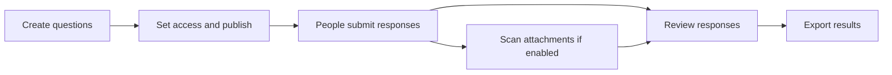

# NC3 Submission Platform

The NC3 Submission Platform helps an organization collect information through online forms and review the responses in one place. It is built by the National Cybersecurity Competence Center (NC3), part of the Luxembourg House of Cybersecurity.

A form owner creates the questions, decides who can respond, and shares the form. People fill it in and attach documents when needed. The owner and assigned reviewers can then read the responses and export them. Optional malware scanning checks attachments before reviewers download them.

For example, a team could create a report form with sections for contact details, a description of an incident, and supporting documents. The team can accept public responses or restrict access, then give selected colleagues permission to review the reports.

## Start with what you need to do

| I want to… | Read this |
| --- | --- |
| Fill in a form or return to a draft | [Submitting a response](https://github.com/NC3-LU/submission-platform/wiki/Submitting-a-Response) |
| Create, publish, or share a form | [Managing forms](https://github.com/NC3-LU/submission-platform/wiki/Managing-Forms) |
| Read responses and download attachments or exports | [Reviewing submissions](https://github.com/NC3-LU/submission-platform/wiki/Reviewing-Submissions) |
| Install a local development copy | [Getting started](https://github.com/NC3-LU/submission-platform/wiki/Getting-Started) |
| Deploy and maintain the service | [Running the platform](https://github.com/NC3-LU/submission-platform/wiki/Running-the-Platform) |
| Connect another application | [API and integrations](https://github.com/NC3-LU/submission-platform/wiki/API-and-Integrations) |
| Understand or change the code | [Development](https://github.com/NC3-LU/submission-platform/wiki/Development) |
| Work out why something is unavailable | [Troubleshooting](https://github.com/NC3-LU/submission-platform/wiki/Troubleshooting) |

## How the pieces fit together

A **form** is the set of questions. A **category** is a section within that form. A **submission** is one person's saved response. An **evaluator** is an account that can create forms and review forms it has been assigned to. An **access link** lets its holder open a private form; it does not grant access to other people's answers.

## What is available

- A form builder with text, long answers, choices, checkboxes, file uploads, and explanatory headings.
- Sections, conditional questions, Markdown descriptions, and optional header images.
- Public forms, forms that require sign-in, and private forms with controlled access.
- Draft saving for signed-in respondents and fixed answers after submission.
- Assigned reviewers, attachment scan details, and PDF, JSON, or spreadsheet exports.
- An API for forms, responses, access links, collaborators, tokens, background exports, and optional webhooks.

The platform supports review statuses, but the full custom workflow builder and dedicated browser review page are unfinished. Email-code invitations and encrypted submission-file storage are also roadmap items. Private file storage controls who can download an attachment; it is not a claim that submission files are encrypted at rest.

## About these pages

These pages describe the code reviewed on **14 September 2026**. The current code requires PHP 8.3+ and Laravel 13. A deployed instance may run an earlier release or have optional features disabled.

For exact integration rules, use the [API contract](https://github.com/NC3-LU/submission-platform/blob/main/docs/api.md). For production procedures, use the [operations runbook](https://github.com/NC3-LU/submission-platform/blob/main/docs/operations.md). Release history is in the [changelog](https://github.com/NC3-LU/submission-platform/blob/main/CHANGELOG.md).

General project enquiries: **info@lhc.lu**. Report security issues through [GitHub Security Advisories](https://github.com/NC3-LU/submission-platform/security/advisories) or **abuse@lhc.lu**. Data-protection enquiries: **privacy@lhc.lu**.

The project is licensed under [GNU AGPL v3.0](https://github.com/NC3-LU/submission-platform/blob/main/LICENSE).
